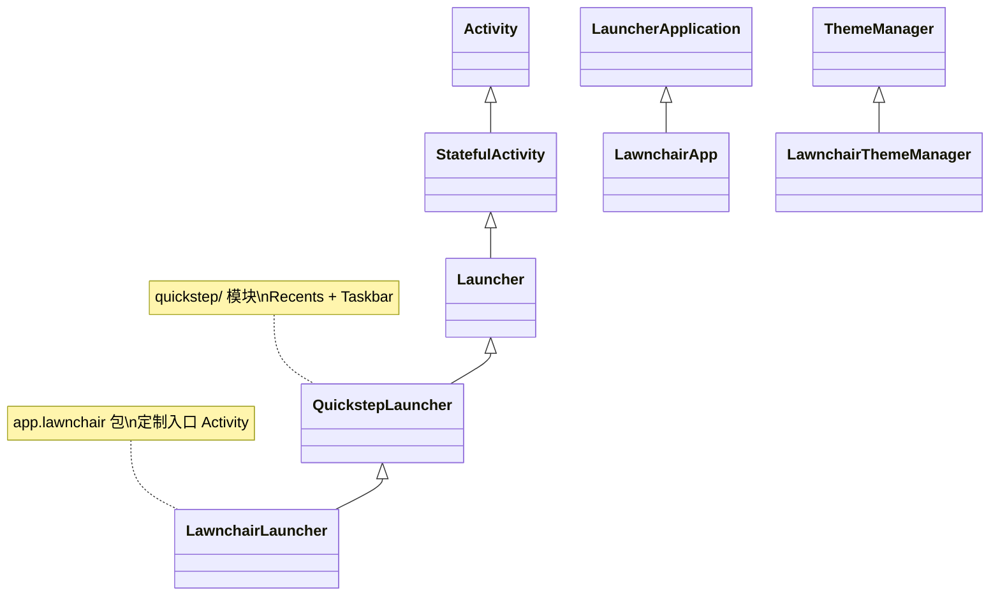
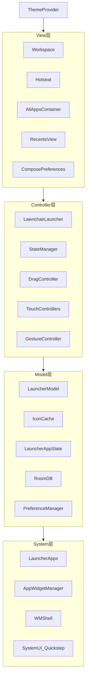
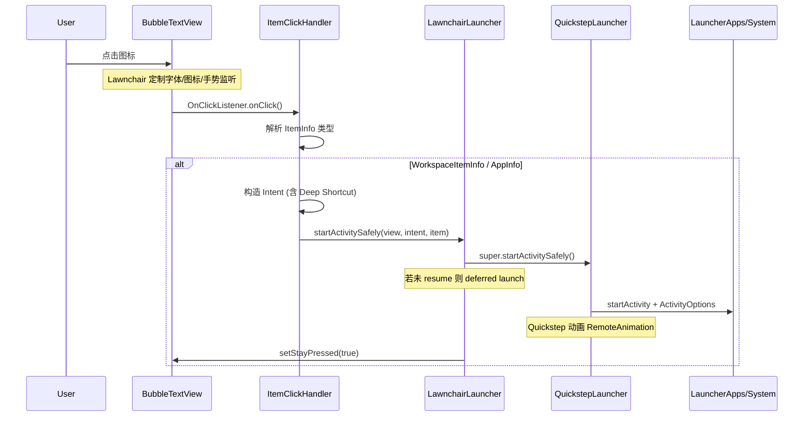
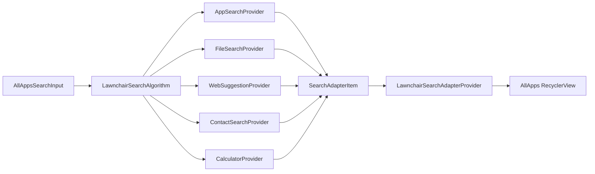

# Lawnchair 16 Launcher3 定制技术分析文档

> **文档版本**：1.0  
> **分析对象**：Lawnchair 16（`16-dev` 分支，Development 5.1）  
> **上游基线**：AOSP Launcher3 + Quickstep（Android 16 / Baklava，`android-16.0.0_r3`）  
> **工作区路径**：`/Volumes/T7/code/lawnchair`

---

## 1. 项目说明书

### 1.1 项目概述

| 维度 | 说明 |
|------|------|
| **项目名称** | Lawnchair 16 |
| **当前版本** | Development 5.1（versionCode `16_00_01_05_01`） |
| **ApplicationId** | `app.lawnchair`（GitHub）/ `app.lawnchair.play`（Play Store）/ `app.lawnchair.nightly`（Nightly） |
| **入口 Activity** | `app.lawnchair.LawnchairLauncher` |
| **Application 类** | `app.lawnchair.LawnchairApp` |
| **minSdk** | 26（Android 8.0） |
| **targetSdk / compileSdk** | 37 |
| **Quickstep 支持范围** | Release：SDK 29–36（Android 10–15）；Debug：无 SDK 限制 |
| **推荐构建变体** | `lawnWithQuickstepGithubDebug` |

Lawnchair 是一款基于 AOSP Launcher3 的开源第三方桌面应用。它以 Pixel Launcher（Quickstep）能力为基准，在保持 Launcher3 核心架构的前提下，通过独立 `lawnchair/` 代码包实现主题、搜索、手势、Icon Pack 等深度定制。

> **稳定性提示**：`16-dev` 分支处于 Android 16 rebase 阶段，可能存在崩溃；生产环境建议 Lawnchair 15 Beta 3。

### 1.2 修改目标

| 目标 | 实现方式 |
|------|----------|
| 移植 Pixel Launcher 特性 | 引入 Quickstep、SystemUI、WM Shell 子模块 |
| 提供丰富自定义能力 | Compose 设置页 + Opto/DataStore 偏好系统 |
| 跨版本 Recents 集成 | `compatLib` 兼容 Android 10–16 Quickstep API 差异 |
| 最小化 AOSP 侵入 | 新功能优先放在 `lawnchair/`，`src/` 改动控制在必要 hook 点 |
| 支持多渠道分发 | `github` / `play` / `nightly` Product Flavor |

### 1.3 核心功能列表

#### 1.3.1 保留的原生 Launcher3 / Quickstep 功能

- **Workspace**：多页桌面、CellLayout、Folder、Widget 放置与 resize
- **Hotseat**：Dock 栏与应用预测（Quickstep 路径）
- **All Apps Drawer**：含 Private Space、Work Profile 等 AOSP 16 能力
- **Quickstep Recents**：Overview、Taskbar、Split Screen、Bubble 等
- **StateManager 状态机**：`NORMAL` / `ALL_APPS` / `OVERVIEW` / `SPRING_LOADED` 等
- **LauncherModel + SQLite**：布局持久化
- **IconCache / ThemeManager**：AOSP 图标管线（Lawnchair 扩展）
- **Widget Picker**：`modules/widgetpicker`
- **Material 3 Expressive 主题**：跟随 AOSP 16

#### 1.3.2 Lawnchair 新增 / 增强功能

| 类别 | 功能 |
|------|------|
| **主题与外观** | Monet 动态取色、自定义 Accent、图标形状、字体（含 Google Fonts）、圆角 Widget、状态栏/导航栏控制 |
| **图标** | Icon Pack 支持、Themed Icons、单应用图标 override（Room DB）、自定义 Adaptive Icon |
| **Smartspace** | At a Glance 风格信息区，Smartspacer SDK 集成 |
| **搜索** | 全局搜索（应用、联系人、文件、网页、计算器、历史记录等） |
| **QSB** | 可配置搜索栏提供商（Google、DuckDuckGo、Firefox 等） |
| **手势** | 双击、上下滑、双指滑、Home/Back 键自定义动作 |
| **Hotseat 模式** | Lawnchair / Google Search / Disabled |
| **Feed（-1 屏）** | `FeedBridge` + `OverlayCallbackImpl` 对接 Google Feed 等 |
| **QuickSwitch** | `compatLib` 跨版本 Recents 集成（需 root / 专用工具） |
| **备份恢复** | Lawnchair 布局与偏好备份 |
| **设置 UI** | 完整 Jetpack Compose 偏好页 |
| **Root 能力** | LibSU、暂停应用、部分系统级操作 |
| **Flowerpot** | 应用分类规则引擎 |
| **Deck** | 文件夹批量创建等布局工具 |

#### 1.3.3 相对原生移除 / 弱化的能力

- 不以 **系统 priv-app** 身份运行，部分需 `signature|privileged` 的权限不可用
- Manifest 中移除了 AOSP 的 `READ/WRITE_SETTINGS`、`HOTSEAT_EDU` 等自定义 permission 声明
- Play Store 渠道功能受 Google 政策约束
- Android 16 设备上 Quickstep 官方支持范围尚未完全覆盖（`QUICKSTEP_MAX_SDK = 36`）

### 1.4 依赖组件与第三方库

#### 1.4.1 Gradle 模块结构

```
lawnchair (app)
├── src/                         ← AOSP Launcher3 主体 (~598 Java/Kotlin 文件)
├── quickstep/                   ← Quickstep + Recents
├── lawnchair/                   ← Lawnchair 定制 (~460 Kotlin 文件)
├── systemUI/                    ← SystemUI 子集 (shared, animation, unfold, plugin...)
├── wmshell/                     ← WindowManager Shell
├── compatLib/                   ← Quickstep 跨版本兼容 (Q~Baklava)
├── platform_frameworks_libs_systemui/  ← iconloaderlib, searchuilib, animationlib...
├── hidden-api/                  ← Hidden API 访问封装
├── flags/, dagger/, concurrent/
└── modules/widgetpicker/
```

#### 1.4.2 AOSP 预编译 JAR（`prebuilts/libs/`）

| JAR | 用途 | AOSP Tag |
|-----|------|----------|
| `framework-16.jar` | 编译期访问 framework hidden API | android-16.0.0_r3 |
| `SystemUI-core-16.jar` | SystemUI 内部类 | android-16.0.0_r3 |
| `SystemUI-statsd-16.jar` | Stats 日志 | android-16.0.0_r3 |
| `WindowManager-Shell-16.jar` | WM Shell / Split / Bubble | android-16.0.0_r3 |

#### 1.4.3 主要第三方库

| 库 | 用途 |
|----|------|
| Jetpack Compose + Material3 | 设置 UI、About、备份界面 |
| Dagger / Hilt | 与 AOSP Launcher3 DI 体系集成 |
| Room | Icon override、Wallpaper 缓存等 |
| DataStore / Opto | 类型安全偏好存储 |
| Retrofit + OkHttp | GitHub API、Live Info |
| Coil | 图片加载 |
| LibSU | Root shell |
| Smartspacer SDK | Smartspace 扩展 |
| colorkt / monet | 颜色与 Material You |
| RestrictionBypass + Rikka Refine | Hidden API 绕过 |
| Reorderable | Compose 拖拽排序 |
| Lottie / Hoko Blur | 动画与模糊效果 |
| FuzzyWuzzy | 搜索模糊匹配 |

---

## 2. 与原生 Launcher3 的差异分析

### 2.1 代码层差异

#### 2.1.1 入口与继承链



| 类 | 包路径 | 说明 |
|----|--------|------|
| `LawnchairLauncher` | `app.lawnchair` | 最终 Activity 入口，注入手势/主题/Feed 等 |
| `LawnchairApp` | `app.lawnchair` | Application，Recents 可用性检测 |
| `QuickstepLauncher` | `com.android.launcher3.uioverrides` | AOSP Quickstep 基类 |
| `Launcher` | `com.android.launcher3` | AOSP Launcher3 核心 |

#### 2.1.2 新增模块（`app.lawnchair.*`）

| 包路径 | 职责 |
|--------|------|
| `theme/` | ThemeProvider、ColorTokens、Monet 适配 |
| `icons/` | IconPack、IconShape、LawnchairThemeManager |
| `search/` | 搜索引擎、Provider 链、Adapter |
| `gestures/` | GestureController、Handler 配置 |
| `smartspace/` | Smartspace 宿主与 DataSource |
| `qsb/` | Quick Search Box 布局与 Provider |
| `ui/preferences/` | Compose 设置页 |
| `preferences/` + `preferences2/` | 旧/新偏好系统 |
| `data/` | Room DB（icon override、wallpaper、folder） |
| `nexuslauncher/` | Pixel Launcher 兼容层（Feed、Smartspace Host） |
| `compat/` | Quickstep 版本兼容门面 |
| `backup/` | 备份恢复 |
| `root/` | RootHelperManager |
| `overview/` | Recents 动作视图扩展 |

#### 2.1.3 AOSP 代码侵入点

约 **80+** 个 `src/` 文件直接 `import app.lawnchair.*`，典型模式：

1. **Dagger 注入扩展**：`LauncherBaseAppComponent` 注册 Lawnchair 单例
2. **视图层 Token 化**：`BubbleTextView`、`Folder` 等通过 `ColorTokens` / `DrawableTokens` 读取主题
3. **DeviceProfile 覆盖**：`DeviceProfile.java` 引用 `DeviceProfileOverrides.TextFactors`
4. **Widget 宿主替换**：`LauncherAppWidgetHost` → `LawnchairAppWidgetHostView`
5. **AppFilter / DatabaseHelper**：读取隐藏应用、网格偏好

#### 2.1.4 compatLib 跨版本模块

| 模块 | Android 版本 |
|------|--------------|
| `compatLibVQ` | 10 |
| `compatLibVR` | 11 |
| `compatLibVS` | 12 |
| `compatLibVT` | 13 |
| `compatLibVU` | 14 |
| `compatLibVV` | 15 |
| `compatLibVBaklava` | 16 |

用于 QuickSwitch 等场景下，使 Lawnchair 的 Quickstep 实现与不同系统版本的 Recents Provider 对接。

### 2.2 资源层差异

| 类型 | Lawnchair 定制 |
|------|----------------|
| **布局** | `lawnchair/res/layout/` 搜索栏、Smartspace、Wallpaper Carousel、Overview Actions |
| **Workspace 网格** | `default_workspace_3x3.xml` ~ `5x5.xml`，用户可通过设置切换 |
| **dimens** | 多 `sw600dp` / `sw700dp` / `sw900dp` 平板适配 |
| **主题色** | `color/`、`color-v29/` Material You token 覆盖 |
| **字符串** | 70+ 语言 Crowdin 翻译 |
| **assets** | Flowerpot 分类规则、备份模板 |
| **Manifest** | 额外权限（联系人、媒体、Usage Stats、Smartspacer 等） |

### 2.3 行为差异

| 行为 | 原生 Launcher3 | Lawnchair |
|------|----------------|-----------|
| **图标加载** | AOSP ThemeManager + IconCache | `LawnchairThemeManager` 扩展形状/阴影/Monochrome；Icon Pack 映射 |
| **拖拽** | 标准 DragController | 基本一致，Folder 动画可受 ColorOption 影响 |
| **手势** | 系统导航手势 + Quickstep | 额外 VerticalSwipe / 双击 / Home&Back 自定义 Handler |
| **All Apps 搜索** | 默认本地搜索 | 多 Provider 管道（Web、File、Contact、Calculator…） |
| **Hotseat** | 固定 dock | 可切换为 Google Search 栏或禁用 |
| **Feed** | Pixel 专属 | FeedBridge 对接第三方 Feed |
| **Recents** | 系统 priv-app | 第三方 + compatLib；Android 16 上可能禁用 |
| **状态栏** | 系统默认 | 可隐藏状态栏、控制时钟显示 |
| **长按菜单** | AOSP SystemShortcut | 增加 Uninstall、Customize、Pause Apps 等 |

---

## 3. 代码层次架构

### 3.1 整体架构

Lawnchair 沿用 Launcher3 的 **State-driven MVC 变体**：



- **无传统 MVVM**：Model 由 `LauncherModel` + `BgDataModel` 驱动；View 为自定义 View 体系 + 部分 Compose
- **状态机核心**：`StateManager<LauncherState>` 协调 Workspace 缩放、All Apps 滑入、Overview 切换
- **DI**：Dagger `@LauncherAppSingleton` 管理跨 Activity 单例

### 3.2 核心模块说明

| 模块 | 关键类 | 职责 |
|------|--------|------|
| **Launcher** | `LawnchairLauncher` | Activity 入口、TouchController 组装、Shortcut 扩展 |
| **Workspace** | `Workspace`, `CellLayout`, `ShortcutAndWidgetContainer` | 桌面页、单元格布局、Item 容器 |
| **Hotseat** | `Hotseat`, `HotseatPredictionController` | Dock 栏；Lawnchair 通过 `HotseatMode` 切换模式 |
| **All Apps** | `ActivityAllAppsContainerView`, `LawnchairAlphabeticalAppsList` | 应用抽屉 + Lawnchair 搜索 UI |
| **DragController** | `DragController`, `DragLayer` | 跨 Workspace/Hotseat/Folder 拖拽 |
| **Icon 管线** | `IconCache`, `LawnchairThemeManager`, `IconPackProvider` | 图标解码、主题化、第三方包映射 |
| **Model** | `LauncherModel`, `LoaderTask`, `ModelWriter` | 异步加载 DB、绑定 View |
| **Quickstep** | `QuickstepLauncher`, `RecentsView`, `TaskbarManagerImpl` | 手势导航、最近任务、Taskbar |
| **Search** | `LawnchairSearchAlgorithm`, `SearchTargetFactory` | 聚合搜索 Provider |
| **Theme** | `ThemeProvider`, `ColorTokens` | Monet 动态主题 → View token |

### 3.3 数据流：点击图标 → 启动应用



**Lawnchair 附加链路**：

- `BubbleTextView` 应用 `FontManager` 字体、`PreferenceManager2` 标签样式
- `IconGestureListener` 可在点击前拦截（图标级手势）
- Quickstep 可用时，`QuickstepTransitionManager` 负责 App Launch 与 Recents 动画衔接
- 统计：`StatsLogManager.LAUNCHER_APP_LAUNCH_TAP`

### 3.4 关键类继承 / 扩展关系

```
android.app.Activity
└── StatefulActivity<LauncherState>
    └── Launcher                          ← src/com/android/launcher3/
        └── QuickstepLauncher             ← quickstep/ (RecentsViewContainer)
            └── LawnchairLauncher         ← lawnchair/ (定制入口)

android.app.Application
└── LauncherApplication
    └── LawnchairApp

com.android.launcher3.graphics.ThemeManager
└── LawnchairThemeManager                 ← 图标主题扩展

com.android.launcher3.search.SearchAlgorithm
└── LawnchairSearchAlgorithm              ← 搜索算法族

com.android.launcher3.widget.LauncherAppWidgetHostView
└── LawnchairAppWidgetHostView            ← 圆角 Widget 等
```

**Gradle sourceSets 划分**：

| SourceSet | 内容 |
|-----------|------|
| `main` | `src/`, `src_plugins/`, `compose/` |
| `lawn` | `lawnchair/src`, `lawnchair/res`, `src_flags`, `src_shortcuts_overrides` |
| `withQuickstep` | `quickstep/src`, `quickstep/res`, `quickstep/dagger` |

**Dagger 扩展点**（`LauncherBaseAppComponent`）：

- Lawnchair 服务通过 `@Inject` 注入到 AOSP 类
- 新增模块应注册为 `@LauncherAppSingleton` 并加入 Component interface

### 3.5 搜索数据流（Lawnchair 扩展）



---

## 4. Launcher3 适配方法（通用指南）

### 4.1 屏幕适配（dpi、分辨率、刘海/挖孔屏）

#### AOSP 机制

- `InvariantDeviceProfile` + `DeviceProfile`：根据屏幕尺寸选择 grid（`device_profiles.xml`）
- `ResponsiveSpecsProvider`：Android 14+ 响应式 cell/hotseat spec
- `DisplayController`：监听旋转、折叠、多屏

#### Lawnchair 做法

- `DeviceProfileOverrides` 允许用户覆盖行列数、Hotseat 列数，映射到不同 SQLite DB 文件（`launcher_{rows}_{cols}_{hotseat}.db`）
- `lawnchair/res/xml-sw600dp/` 等 qualifier 覆盖平板 padding
- 状态栏/挖孔：`WindowInsetsCompat` + `showStatusBar` 偏好

#### 移植建议

1. 优先改 `res/xml/device_profiles.xml` 和 `dimens.xml`，而非硬编码像素
2. 使用 `WindowInsets` 处理 cutout，避免固定 `statusBarHeight`
3. 横竖屏分别维护 `INDEX_LANDSCAPE` / `INDEX_DEFAULT` grid option
4. 折叠屏启用 `INDEX_TWO_PANEL_*` 配置

### 4.2 系统版本适配（Android 10–16）

| 版本 | 关键变更 | Lawnchair 应对 |
|------|----------|----------------|
| **10 (Q)** | 手势导航、Scoped Storage 萌芽 | `compatLibVQ`；Quickstep 集成起点 |
| **11 (R)** | 分区存储 enforced | 文件搜索需 SAF / MediaStore |
| **12 (S)** | Monet 主题、Splash Screen | `ThemeProvider` + `SystemColorScheme` |
| **12L/13** | Taskbar、Per-app 语言 | TaskbarProfile 跟随 AOSP |
| **14 (U)** | 预测性 Back、Partial Media Access | `READ_MEDIA_VISUAL_USER_SELECTED` |
| **15 (V)** | Private Space | AOSP Private Space UI + Lawnchair 隐藏应用 |
| **16 (Baklava)** | Expressive M3、BubbleBar | 跟随 AOSP rebase；Quickstep compat 进行中 |

**权限模型**：

- Lawnchair Manifest 声明 contacts、media、usage stats 等；Play 渠道需运行时请求 + 政策合规
- Hidden API：通过 `hidden-api` 模块 + prebuilt framework JAR + Refine 注解访问

### 4.3 硬件适配（遥控器、触控板、外设）

| 场景 | 说明 |
|------|------|
| **AOSP 基础** | `FocusHelper` / D-pad 导航；`TouchController` 链处理触摸 |
| **Lawnchair 扩展** | `GestureController` 面向触摸屏；`LawnchairAccessibilityService` 支持部分无障碍手势 |
| **TV/遥控器** | Override `Workspace.dispatchKeyEvent`，确保 Focus 可见 |
| **触控板** | 依赖 Quickstep 的 `InputConsumer` 链；测试三指/四指手势冲突 |
| **Stylus** | AOSP `StylusHandler` 在 Quickstep 路径 |

### 4.4 性能优化建议

| 方向 | 做法 |
|------|------|
| **启动速度** | Baseline Profile（`baseline-profile/`）；减少 `Application.onCreate` 同步 IO |
| **滑动帧率** | RecyclerView prefetch；All Apps 搜索 debounce；避免主线程读 DB |
| **内存** | IconCache 缓存上限；`onTrimMemory` 释放 Widget preview DB |
| **图标** | `LawnchairThemeManager` 批量 invalidation；Icon Pack 映射缓存 |
| **Compose 设置** | 与 Launcher 主线程隔离；使用 `remember` + `Flow` 避免重组风暴 |

### 4.5 定制化扩展点（无侵入优先）

Lawnchair 官方推荐的扩展策略：

| 优先级 | 扩展方式 | 示例 |
|--------|----------|------|
| **1（最佳）** | 新建 `lawnchair/` 类，通过 Dagger 注入 | `ThemeProvider`, `DeviceProfileOverrides` |
| **2** | 继承 AOSP 类替换 Factory | `LawnchairLayoutFactory`, `LawnchairAppWidgetHostView` |
| **3** | 实现 AOSP 接口/抽象类 | `SearchAlgorithm`, `HotseatMode`, `SmartspaceProvider` |
| **4** | 最小 diff 修改 `src/` | `BubbleTextView` 读 ColorTokens |
| **5（避免）** | 大面积 fork AOSP 文件 | 仅在 rebase 必要时 |

**常见扩展接口**：

- **主题引擎**：实现 `ColorOption` + 监听 `ThemeProvider.addListener`
- **Icon Pack**：实现 `IconPack` 接口，注册到 `IconPackProvider`
- **搜索 Provider**：实现 `SearchProvider`，注册到 `LawnchairSearchAlgorithm` 引擎
- **手势 Handler**：实现 `GestureHandlerConfig` 子类，在 `GestureController` 注册

### 4.6 AOSP Rebase 工作流（Lawnchair 特有）

1. 从 AOSP 拉取对应版本 Launcher3 / Quickstep / SystemUI 源码
2. 更新 `prebuilts/libs/` 中 framework / SystemUI JAR
3. 合并 `src/` 与 `quickstep/`，保留带 `app.lawnchair` import 的 hook 点
4. 更新 `compatLibV*` 模块以匹配新 API
5. 运行 CI + TAPL 测试，修复编译与行为回归

---

## 5. 附录：常见问题与解决方案

### 5.1 关键代码片段

**入口 Activity**：

```kotlin
// lawnchair/src/app/lawnchair/LawnchairLauncher.kt
class LawnchairLauncher : QuickstepLauncher() {
    // 手势、主题、Feed、状态栏等定制逻辑
}
```

**Application 与 Recents 开关**：

```kotlin
// lawnchair/src/app/lawnchair/LawnchairApp.kt
class LawnchairApp : LauncherApplication() {
    override fun onCreate() {
        super.onCreate()
        QuickStepContract.sRecentsDisabled = !recentsEnabled
    }
}
```

**网格覆盖**：

```kotlin
// lawnchair/src/app/lawnchair/DeviceProfileOverrides.kt
fun setCurrentGrid(gridName: String) {
    prefs.workspaceRows.set(gridInfo.numRows)
    prefs.workspaceColumns.set(gridInfo.numColumns)
    prefs.hotseatColumns.set(gridInfo.numHotseatColumns)
}
```

### 5.2 常见问题

| 问题 | 原因 | 解决方案 |
|------|------|----------|
| 编译失败：framework JAR 不存在 | 缺少 AOSP 预编译库 | 按 `prebuilts/libs/README.md` 构建 AOSP 或获取预置 JAR |
| Recents 不可用 | SDK 超出 29–36 或非默认 Recents 组件 | 使用 QuickSwitch / root；或接受无 Recents 模式 |
| 图标包不生效 | Icon Pack 未正确解析 | 检查 `ApplyIconPackActivity`、Themed Icon 设置 |
| 网格切换丢布局 | 不同 grid 使用不同 DB 文件 | 正常行为；可用备份迁移 |
| Android 16 崩溃 | `16-dev` 分支处于 rebase 不稳定期 | 生产环境建议 Lawnchair 15 Beta 3 |
| Hidden API 反射失败 | 系统版本与 compatLib 不匹配 | 更新对应 `compatLibV*` 模块 |
| Submodule 缺失 | 未递归 clone | `git clone --recursive` 或 `git submodule update --init --recursive` |

### 5.3 构建与调试

```bash
# 克隆（含 submodule）
git clone --recursive https://github.com/LawnchairLauncher/lawnchair.git
cd lawnchair
git checkout 16-dev

# Android Studio 选择构建变体
# lawnWithQuickstepGithubDebug

# 命令行构建
./gradlew assembleLawnWithQuickstepGithubDebug
```

### 5.4 参考链接

- [Lawnchair GitHub](https://github.com/LawnchairLauncher/lawnchair)
- [Contributing Guidelines](../CONTRIBUTING.md)
- [compatLib README](../compatLib/README.md)
- [Prebuilt Libraries](../prebuilts/libs/README.md)
- [AOSP Launcher3 源码（Android 16）](https://android.googlesource.com/platform/packages/apps/Launcher3/)

### 5.5 文档维护说明

| 字段 | 值 |
|------|-----|
| 分析基准 commit | 工作区当前 HEAD |
| 待补充项（若 fork 定制） | 修改背景、目标设备清单、与上游 diff、测试矩阵 |

---

*本文档由 AI 基于 Lawnchair 16-dev 代码库自动生成，术语保留英文原词（Workspace、Hotseat、Quickstep 等）。*
